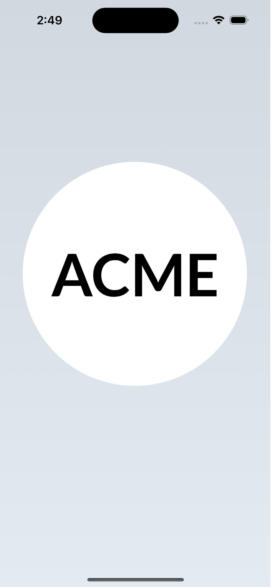
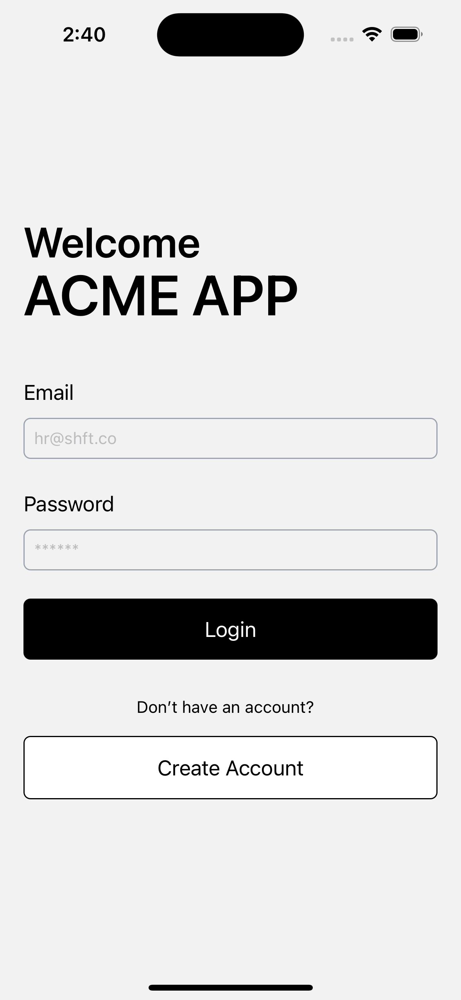
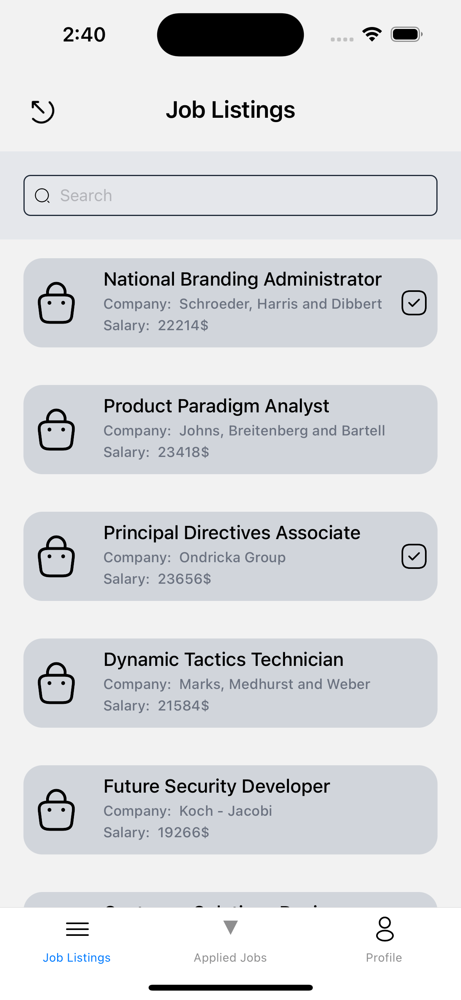
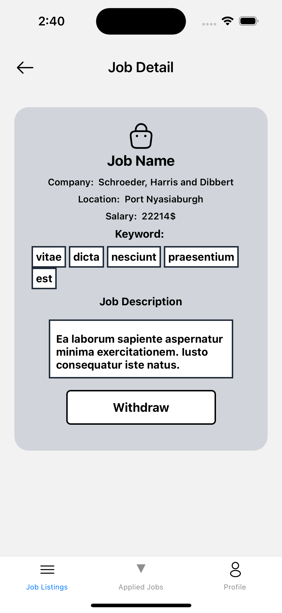
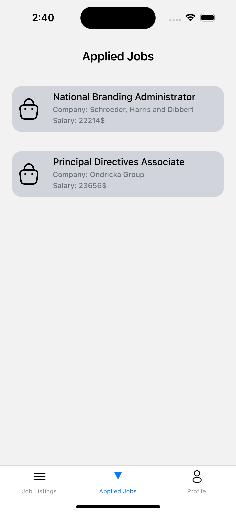
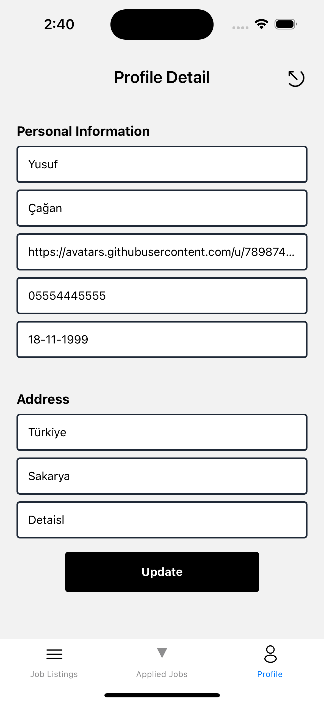

# ACME APP SHFT React Native Application

This project is a "Job Finder" app that allows users to search, filter, and apply for job listings.

## Installation

First, you need to install the necessary packages. Use the following commands:

```bash
npm install
```

Then, navigate to the iOS directory and run the following command to install the required CocoaPods dependencies:

```bash
cd ios
pod install
```

## Running the Application

You can run the application using the following commands based on your development platform:

- For iOS:

```bash
npm run ios
```

- For Android:

```bash
npm run android
```

## Screenshots

Here are some screenshots from the application:

1. Splash Screen
   <br/>
   

2. Login Screen
   <br/>
   

3. Job Listings Screen
   <br/>
   

4. Job Detail Screen
   <br/>
   

5. Applied Job Screen
   <br/>
   

6. Profile Screen
   <br/>
   
